# Manovritti - Privacy-First AI Mind Journal 🧘‍♂️🧠

> **Enterprise-Grade, Zero-Knowledge Encrypted Cognitive Journaling & Mood Intelligence Companion** powered by **Gemini 3.6 Flash**, **Web Crypto API (AES-GCM 256-bit)**, **Cloud Firestore**, and **React 19 + Express**.

---

## 📑 Table of Contents
1. [Overview & Core Philosophy](#-overview--core-philosophy)
2. [System Architecture & Flow Diagrams](#-system-architecture--flow-diagrams)
   - [High-Level Architecture](#1-high-level-architecture)
   - [Zero-Knowledge Encryption Flow](#2-zero-knowledge-encryption-flow)
   - [Gemini Cognitive Analysis & Fallback Pipeline](#3-gemini-cognitive-analysis--fallback-pipeline)
   - [Multi-Provider Authentication Lifecycle](#4-multi-provider-authentication-lifecycle)
3. [Repository Directory Map](#-repository-directory-map)
4. [Local Setup & Running Guide](#-local-setup--running-guide)
   - [Prerequisites](#prerequisites)
   - [Environment Configuration](#environment-configuration)
   - [Installation & Startup](#installation--startup)
5. [Complete Step-by-Step Testing Guide](#-complete-step-by-step-testing-guide)
6. [Cloud Run Deployment & Production Guide](#-cloud-run-deployment--production-guide)
7. [Security Model & Firestore Rules](#-security-model--firestore-rules)
8. [Threat Modeling & Countermeasures](#-threat-modeling--countermeasures)

---

## 🌟 Overview & Core Philosophy

**Manovritti** (*मनोवृत्ति* - Sanskrit/Marathi for *the disposition or workings of the mind*) is an end-to-end encrypted personal cognitive companion. It bridges empathetic artificial intelligence with zero-knowledge data privacy:

- 🔒 **Zero-Knowledge Encryption**: Journal entries are encrypted in the user's browser using native `window.crypto.subtle` (AES-GCM 256-bit with a unique 96-bit IV per entry). Raw journal content is **never** sent or stored in plaintext on Cloud Firestore.
- ⚡ **Gemini 3.6 Flash Structured Intelligence**: Generates cognitive reflections, 1–10 mood trajectories, sentiment classification, smart category tags, and context-aware journaling prompts.
- 🛡️ **4-Tier Model Fallback Ladder**: Built with high-availability automated failover (`gemini-3.6-flash` → `gemini-3.1-flash-lite` → `gemini-flash-latest` → `gemini-3.7-flash`).
- 🌐 **Bilingual Support (English & Marathi)**: Full UI localization with `i18next` and native Web Speech API recognition for both English and Marathi (`mr-IN`).
- 📊 **Longitudinal Mood Trajectory & 7-Day Synthesis**: Interactive visual analytics with Recharts and weekly cognitive aggregate reports.

---

## 🔄 System Architecture & Flow Diagrams

### 1. High-Level Architecture

```mermaid
graph TB
    subgraph Browser ["Client Browser (React 19 + Vite SPA)"]
        UI[Tailwind UI & Components]
        Crypto["Web Crypto API\n(AES-GCM 256-bit Key Derivation)"]
        Speech["Web Speech Recognition\n(en-US / mr-IN)"]
        Charts["Recharts\n(Mood Analytics)"]
    end

    subgraph Backend ["Full-Stack Node/Express Proxy (:3000)"]
        Express["Express Server (server.ts)"]
        ViteDev["Vite Dev Middleware (Dev) /\nStatic Assets (Prod)"]
        GeminiProxy["Gemini AI Proxy Routes\n(/api/gemini/*)"]
        FallbackLadder["4-Tier Model Fallback Ladder"]
    end

    subgraph CloudServices ["Google Cloud & Firebase Platform"]
        GeminiAPI["Google Gemini 3.6 Flash API\n(@google/genai)"]
        Auth["Firebase Authentication\n(Google, Gmail, GitHub, LinkedIn)"]
        Firestore["Cloud Firestore Database\n(Owner-Bound Security Rules)"]
        SecretMgr["Google Cloud Secret Manager\n(GEMINI_API_KEY)"]
    end

    UI -->|1. Plaintext + Web Crypto| Crypto
    Crypto -->|2. Store Encrypted Text + IV| Firestore
    UI -->|3. Query & Decrypt Locally| Crypto
    UI -->|4. Voice Typing| Speech
    UI -->|5. Analytics Visualization| Charts

    UI <-->|6. OAuth Sign-In Popup| Auth
    UI -->|7. POST /api/gemini/* (Session Auth)| Express
    Express --> GeminiProxy
    GeminiProxy --> FallbackLadder
    FallbackLadder -->|8. Structured Output| GeminiAPI
    SecretMgr -.->|Injects Key| Express
```

---

### 2. Zero-Knowledge Encryption Flow

```
+-----------------------------------------------------------------------------------------+
|                                    CLIENT BROWSER                                       |
|                                                                                         |
|  [ User Journal Input ] ---> [ Web Crypto API (SubtleCrypto) ]                          |
|                                    |                                                    |
|                                    | 1. Generate / Retrieve AES-GCM 256-bit Key         |
|                                    | 2. Generate random 12-byte IV                      |
|                                    | 3. Encrypt Plaintext -> Base64 Ciphertext          |
|                                    v                                                    |
|                   +--------------------------------+                                    |
|                   |  Encrypted Document Payload    |                                    |
|                   |  - id: UUID                    |                                    |
|                   |  - encryptedText: "x8fK..."    |                                    |
|                   |  - iv: "b9A2..."               |                                    |
|                   |  - moodScore: 8                |                                    |
|                   |  - tags: ["Growth", "Calm"]    |                                    |
|                   +--------------------------------+                                    |
+-----------------------------------|-----------------------------------------------------+
                                    | HTTPS Write
                                    v
+-----------------------------------------------------------------------------------------+
|                                CLOUD FIRESTORE STORAGE                                  |
|                                                                                         |
|  path: /users/{userId}/entries/{entryId}                                                |
|  Security Rule: allow read, write: if request.auth.uid == userId;                       |
|                                                                                         |
|  [!] Note: Database administrators & cloud operators ONLY see ciphertext & IV.          |
|      Plaintext reflections never reside on disk unencrypted.                             |
+-----------------------------------------------------------------------------------------+
```

---

### 3. Gemini Cognitive Analysis & Fallback Pipeline

```mermaid
sequenceDiagram
    autonumber
    actor User as User / Client
    participant API as Express Server (/api/gemini/analyze)
    participant Ladder as Model Fallback Ladder
    participant G1 as Gemini 3.6 Flash (Primary)
    participant G2 as Gemini 3.1 Flash-Lite (Fallback 1)
    participant G3 as Gemini Flash Latest (Fallback 2)
    participant G4 as Gemini 3.7 Flash (Fallback 3)

    User->>API: POST /api/gemini/analyze (plainText, language)
    API->>Ladder: executeWithFallback(prompt, schema)
    
    rect rgb(30, 41, 59)
        note over Ladder, G1: Attempt 1: Fast Cognitive Reflection
        Ladder->>G1: generateContent(gemini-3.6-flash, responseSchema)
        alt Success (200 OK)
            G1-->>Ladder: Structured JSON Analysis
        else 429 / 503 / Rate Limit / Unavailable
            Ladder->>G2: generateContent(gemini-3.1-flash-lite)
            alt Success
                G2-->>Ladder: Structured JSON Analysis
            else Fail
                Ladder->>G3: generateContent(gemini-flash-latest)
                alt Success
                    G3-->>Ladder: Structured JSON Analysis
                else Fail
                    Ladder->>G4: generateContent(gemini-3.7-flash)
                    G4-->>Ladder: Structured JSON Analysis
                end
            end
        end
    end

    Ladder-->>API: Validated Structured Payload
    API-->>User: { reflection, moodScore, moodLabel, tags, nextPrompt }
```



---

### 4. Multi-Provider Authentication Lifecycle

```
[ User on Landing Page ]
          |
          +---> [ Continue with Google ]   ---> GoogleAuthProvider (select_account)
          +---> [ Sign in with Gmail ]     ---> GoogleAuthProvider (Gmail prompt)
          +---> [ Sign in with GitHub ]    ---> GithubAuthProvider (read:user, user:email)
          +---> [ Sign in with LinkedIn ]  ---> OAuthProvider('linkedin.com')
          |
          v (Popup Resolution)
[ Firebase Auth JWT Token Issued ]
          |
          v
[ Retrieve / Derive AES-256 CryptoKey for user.uid ]
          |
          +---> Derive Fingerprint: SHA-256(RawKeyBytes).slice(0, 4) (e.g. "4A:B1:0C:9F")
          +---> Mount Real-Time Firestore onSnapshot Listeners
          +---> Client Decrypts Entries on-the-fly in Memory
          v
[ Open Personalized Dashboard & Welcome Banner ]
```

---

## 🗂 Repository Directory Map

```text
.
├── .env.example                    # Template for environment variables (GEMINI_API_KEY, APP_URL)
├── .gitignore                      # Git ignore rules for node_modules, build artifacts, dist/
├── README.md                       # Comprehensive project documentation & architecture guide
├── firebase-applet-config.json     # Firebase project client configuration & metadata
├── firestore.rules                 # Owner-bound Cloud Firestore security rules
├── index.html                      # Single Page Application HTML entrypoint
├── metadata.json                   # AI Studio applet metadata & permissions
├── package.json                    # Project dependencies, scripts, and Node engine setup
├── server.ts                       # Full-stack Express backend & Gemini API proxy service
├── tsconfig.json                   # TypeScript compiler configuration
├── vite.config.ts                  # Vite build tooling with Tailwind CSS v4 & React plugin
│
└── src/
    ├── App.tsx                     # Primary dashboard router, state management & tab controller
    ├── i18n.ts                     # Bilingual (English/Marathi) translation dictionary & config
    ├── index.css                   # Tailwind CSS v4 entrypoint (@import "tailwindcss")
    ├── main.tsx                    # React 19 root bootstrap & StrictMode mounting
    ├── types.ts                    # Global TypeScript interfaces, schemas & response types
    │
    ├── components/
    │   ├── AnalyticsView.tsx       # Longitudinal mood area chart, stats & tag frequency cloud
    │   ├── ChatWithGeminiModal.tsx # Multi-turn interactive conversational reflection modal
    │   ├── DailyPromptBanner.tsx   # Context-aware daily cognitive spark component
    │   ├── EncryptionKeyModal.tsx  # AES key inspection, Base64 export/import & JSON backup
    │   ├── EntryCard.tsx           # Decrypted journal card with tags, score badge & chat trigger
    │   ├── JournalEditor.tsx       # Live editor with voice typing, encryption trigger & confetti
    │   ├── LandingPage.tsx         # Multi-provider auth landing page with feature bento grid
    │   ├── Navbar.tsx              # Sticky top header, key fingerprint badge & tab switcher
    │   ├── VoiceRecorder.tsx       # Web Speech API recorder component (en-US / mr-IN)
    │   ├── WelcomeBanner.tsx       # Time-aware personalized greeting & nested daily prompt
    │   └── WeeklySynthesisModal.tsx# 7-day cognitive trend synthesizer & report visualizer
    │
    └── lib/
        ├── crypto.ts               # Web Crypto API wrapper (AES-GCM 256, PBKDF2, Export/Import)
        └── firebase.ts             # Firebase client SDK initialization & OAuth providers
```

---

## 🚀 Local Setup & Running Guide

### Prerequisites
- **Node.js**: `v20.x` or `v22.x` (LTS recommended)
- **npm**: `v10.x` or higher (or `bun` / `pnpm` / `yarn`)
- **Gemini API Key**: From [Google AI Studio](https://aistudio.google.com/)
- **Firebase Project**: A Firebase project with **Firestore** and **Firebase Authentication** enabled.

---

### Step 1: Clone Repository & Create `.env`

```bash
# Clone repository
git clone https://github.com/your-username/manovritti-ai-journal.git
cd manovritti-ai-journal

# Copy example environment file
cp .env.example .env
```

Open `.env` and fill in your Gemini API key:

```env
# .env
GEMINI_API_KEY="AIzaSyYourActualGeminiApiKeyHere"
APP_URL="http://localhost:3000"
```

---

### Step 2: Configure Firebase Client Settings

Ensure `firebase-applet-config.json` contains your Firebase project web credentials:

```json
{
  "apiKey": "AIzaSy...",
  "authDomain": "your-project-id.firebaseapp.com",
  "projectId": "your-project-id",
  "storageBucket": "your-project-id.appspot.com",
  "messagingSenderId": "123456789012",
  "appId": "1:123456789012:web:abcdef"
}
```

---

### Step 3: Install Dependencies

```bash
npm install
```

---

### Step 4: Run in Development Mode

```bash
npm run dev
```

- Boots the combined Express server and Vite development middleware on **`http://localhost:3000`**.
- Hot compilation and server endpoints are immediately live.

---

### Step 5: Build & Run in Production Mode

```bash
# Compile client assets into dist/ and bundle server into dist/server.cjs
npm run build

# Start the compiled CommonJS server
npm run start
```

---

## 🧪 Complete Step-by-Step Testing Guide

Follow these sequential steps to thoroughly test every feature locally:

### 1. Multi-Provider Authentication
1. Navigate to `http://localhost:3000`.
2. Observe the Landing Page with the 4 authentication options:
   - Click **"Continue with Google"** (`#btn-signin-google`)
   - Click **"Gmail"** (`#btn-signin-gmail`)
   - Click **"GitHub"** (`#btn-signin-github`)
   - Click **"LinkedIn"** (`#btn-signin-linkedin`)
3. Complete authentication via the popup window.
4. **Expected Result**: Dashboard loads with your name in the **Welcome Banner** and your photo/initials.

---

### 2. Client-Side AES-256 GCM Key Derivation & Backup
1. In the top navigation bar, locate the **"AES-256 GCM Encrypted"** pill.
2. Click **"Key & Security"** (`#btn-key-security`).
3. **Verify**:
   - The unique 4-byte key fingerprint is displayed (e.g., `3C:7E:1A:8F`).
   - Click **"Copy Key String"** to copy the raw Base64 key to your clipboard.
   - Click **"Download Key File (.json)"** to download the offline disaster-recovery backup.
   - Click **"Done / Close"**.

---

### 3. Voice-to-Text Speech Journaling
1. Under the **"Journal & Write"** tab, scroll to the editor.
2. Click **"Start Voice Input"** (`#btn-voice-input`).
3. Allow browser microphone access if prompted.
4. Speak a reflection aloud: *"Today I completed a challenging software release. I felt proud of the team collaboration but tired after the long sprint."*
5. Click **"Stop Recording"**.
6. **Verify**: Spoken words appear in the editor textarea with character and word counters updating.

---

### 4. Zero-Knowledge Encryption & Gemini Cognitive Analysis
1. With your reflection in the editor, click **"Encrypt & Analyze with Gemini"** (`#btn-save-analyze`).
2. **Verify**:
   - Loading indicator appears (*"Encrypting with AES-GCM 256-bit..."*).
   - Celebration confetti triggers on completion.
   - Cognitive analysis pop-up displays:
     - **Empathetic Reflection**: Contextual psychological insight.
     - **Mood Evaluation**: Score badge (e.g., `8/10`) and mood label (e.g., *"Proud & Reflective"*).
     - **Smart Category Tags**: Generated tags (e.g., `#Accomplishment`, `#Teamwork`, `#Rest`).
     - **Next Thought Prompt**: Suggested question for deeper reflection.

---

### 5. Context-Aware Daily Cognitive Spark
1. In the **Welcome Banner**, observe the **"Daily Cognitive Prompt"** section.
2. Click **"Get New Prompt"** (`#btn-refresh-prompt`).
3. Click **"Reflect on this"** (`#btn-write-about-prompt`).
4. **Verify**: The prompt text automatically copies into the editor textarea ready for journaling.

---

### 6. Multi-Turn Interactive Exploration with Gemini
1. Find any saved journal card in the recent entries feed.
2. Click **"Explore with Gemini"** (`#btn-chat-entry-{id}`).
3. The interactive chat modal opens.
4. Ask a follow-up: *"How can I balance intense sprint weeks with better evening unwinding?"*
5. Click **"Send"** (`#btn-send-chat`).
6. **Verify**: Gemini provides thoughtful, context-aware coaching based on that specific journal entry.

---

### 7. Longitudinal Mood Trajectory & Tag Filtering
1. Click the **"Mood Analytics"** tab in the navigation bar.
2. **Verify**:
   - **Average Mood Score** metric card calculates the mean of all reflections.
   - **Interactive Mood Score Over Time** Recharts area chart plots the chronological trajectory (1–10).
   - **Smart Tag Frequency Cloud** lists all tags with their count.
   - Clicking a tag (e.g., `#Teamwork`) filters the journal timeline to only matching entries.

---

### 8. 7-Day Weekly Cognitive Synthesis
1. Click the **"Weekly Syntheses"** tab in the navigation bar.
2. Click **"Generate Weekly Synthesis"** (`#btn-generate-weekly-synthesis`).
3. **Verify**:
   - Client decrypts entries from the last 7 days and sends them to the backend synthesizer.
   - Weekly report generates: Dominant Emotional Patterns, 7-Day Average Mood Score, and Actionable Cognitive Recommendations.
   - Report is encrypted with AES-256 and saved to Firestore under `/users/{userId}/syntheses`.

---

### 9. Bilingual Language Switcher (English ↔ Marathi)
1. Click the **Language Toggle** in the top navbar (`#btn-language-toggle`).
2. Switch to **मराठी**.
3. **Verify**:
   - All navigation tabs, buttons, placeholders, and greetings switch to Devanagari script.
   - Daily prompts and Gemini analysis prompts adapt automatically to Marathi.
   - Voice input automatically configures to the `mr-IN` speech recognition dialect.

---

### 10. Database Zero-Knowledge Verification
1. Open your Firebase Console -> **Cloud Firestore**.
2. Navigate to `users/{your-user-id}/entries/{entry-id}`.
3. Inspect the document fields:
   - `encryptedText`: `U2FsdGVkX1+...` (Ciphertext string)
   - `iv`: `a1b2c3d4...` (Initialization vector string)
   - `decryptedText`: **Does NOT exist in database**.
4. **Verification**: Proves that data at rest is zero-knowledge encrypted.

---

## ☁️ Cloud Run Deployment & Production Guide

Deploy Manovritti to Google Cloud Run in minutes:

### 1. Enable Required Google Cloud APIs
```bash
gcloud services enable \
  run.googleapis.com \
  secretmanager.googleapis.com \
  firestore.googleapis.com \
  cloudbuild.googleapis.com
```

### 2. Store Gemini API Key in Secret Manager
```bash
# Create secret in Google Cloud Secret Manager
gcloud secrets create GEMINI_API_KEY --replication-policy="automatic"

# Populate with your API key
echo -n "YOUR_ACTUAL_GEMINI_API_KEY" | gcloud secrets versions add GEMINI_API_KEY --data-file=-

# Grant Cloud Run default service account permission to read the secret
PROJECT_NUMBER=$(gcloud projects describe $(gcloud config get-value project) --format="value(projectNumber)")
gcloud secrets add-iam-policy-binding GEMINI_API_KEY \
  --member="serviceAccount:${PROJECT_NUMBER}-compute@developer.gserviceaccount.com" \
  --role="roles/secretmanager.secretAccessor"
```

### 3. Deploy to Cloud Run
```bash
gcloud run deploy manovritti-ai-journal \
  --source . \
  --platform managed \
  --region asia-southeast1 \
  --allow-unauthenticated \
  --set-secrets="GEMINI_API_KEY=GEMINI_API_KEY:latest" \
  --port 3000

# Apply mandatory campaign challenge verification label
gcloud run services update manovritti-ai-journal \
  --update-labels=dev-tutorial=cloud-run-ai-challenge \
  --region=asia-southeast1
```

---

## 🛡️ Security Model & Firestore Rules

Deploy these rules to guarantee strict owner-bound data isolation:

```javascript
rules_version = '2';
service cloud.firestore {
  match /databases/{database}/documents {
    // Isolated User Journal Entries
    match /users/{userId}/entries/{entryId} {
      allow read, write: if request.auth != null && request.auth.uid == userId;
    }
    // Isolated Weekly Cognitive Syntheses
    match /users/{userId}/syntheses/{synthesisId} {
      allow read, write: if request.auth != null && request.auth.uid == userId;
    }
    // Isolated User Encryption Settings
    match /users/{userId}/settings/{settingId} {
      allow read, write: if request.auth != null && request.auth.uid == userId;
    }
  }
}
```

---

## 🔒 Threat Modeling & Countermeasures

| Threat Zone | Identified Attack Vector | Countermeasure Implemented |
| :--- | :--- | :--- |
| **Input Surfaces** | Malicious injection or adversarial prompt formatting in reflections | Input schema validation, plain text parameterization, and strict JSON type parsing |
| **Planning & Reasoning** | LLM hallucination, API outages, or unexpected quota limits | Structured JSON Schema Mode with **4-tier Model Fallback Ladder** |
| **Tool Execution & APIs** | Exposure of `GEMINI_API_KEY` to client-side browser | Server-side Express API proxy (`/api/gemini/*`); zero client key exposure |
| **Memory & Storage State** | Database breach, insider access, or cross-tenant data leaks | **Client-Side AES-256 GCM**: Plaintext encrypted before Firestore dispatch; strict owner-bound security rules |
| **Authentication & Session** | Credential stuffing, brute-forcing, or password leakage | Multi-provider Federated OAuth (Google, Gmail, GitHub, LinkedIn); zero password storage |

---

## 📄 License
This project is licensed under the **MIT License**.
